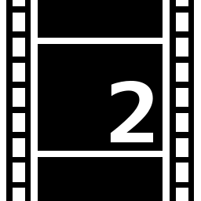
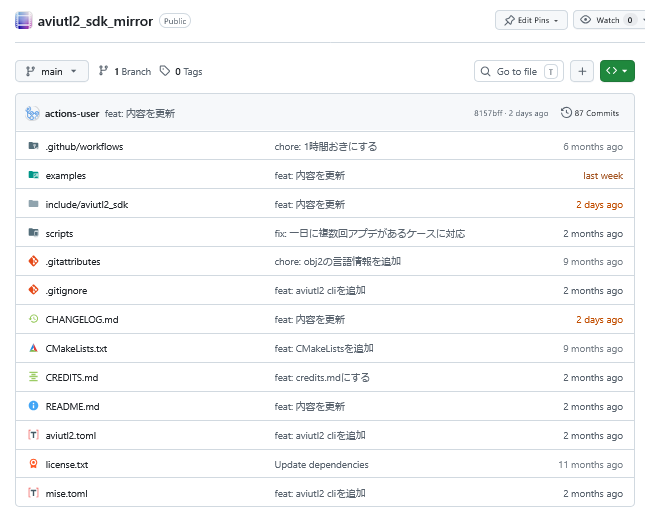
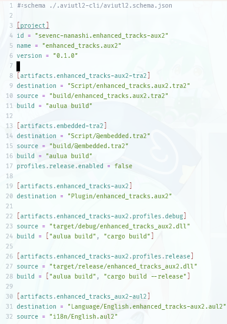

---
# try also 'default' to start simple
theme: default
title: 【令和最新版】【2026年度7月版】AviUtl2のプラグインを作ろう！
info: |
  KANTO Tech Circle Meetupの発表資料です。
# apply UnoCSS classes to the current slide
class: text-center
# https://sli.dev/features/drawing
drawings:
  persist: false
# slide transition: https://sli.dev/guide/animations.html#slide-transitions
transition: slide-left
# enable Comark Syntax: https://comark.dev/syntax/markdown
comark: true
fonts:
  sans: "M PLUS 1p"
  weights: 400,700
---

# 【令和最新版】【2026年度7月版】AviUtl2のプラグインを作ろう！

名無し。（@sevenc_nanashi / sevenc7c.com）

---

# どなた？

- 名無し。/ Nanashi.
- 電気通信大学25年度生 B2 I類
- MMA / VLL
- VOICEVOXメンテナーの一人（エディタ担当）
- Kiite Cafe DesktopやKikouneも作ったり
- AviUtl2関連でいろいろ作ったり
- 曲も作ったり

https://sevenc7c.com

---

# AviUtl2、使ってますか？

- 正式名称：AviUtl ExEdit2
- AviUtlの正統後継ソフトウェア
- 2025/7/7に2.00 beta1がリリース
  - 祝！一周年
  - 一周年記念に正式版リリース（2026/7/7）
- 毎週末に更新！
- 現在はv2.0.54

---

# 変更点

- 64bit化
- UTF-8対応
- プラグインAPIの刷新・拡張
- パッケージフォーマットの確立（.au2pkg.zip）

## コミュニティ側の変化

- 巨大コミュニティの誕生（「AviUtl2の情報が知りたいだろって！！」）
- 主流と呼べるパッケージマネージャーの誕生（AviUtl2 カタログ）
- GitHubでのプラグイン・スクリプト配布の増加

---

# プラグインで何ができる？

- 入力プラグイン：読み込めるフォーマットを増やす
- 出力プラグイン：出力できるフォーマットを増やす
- フィルタプラグイン：エフェクト、オブジェクトを追加する
  - 「アニメーション効果（anm）」、「カスタムオブジェクト（obj）」相当
- 汎用プラグイン：AviUtl2の機能を拡張する
  - アクションの追加、カスタムUIの挿入など

- （スクリプトモジュール：スクリプトで使える関数を追加する）

---

# プラグインを作ろう！

---
transition: fade

---

# AviUtl1のプラグインの作り方（参考）

- AviUtl SDK（zip）をダウンロード
  - 必要に応じてShift-JISからUTF-8に変換
- C++でコードを書く
- Visual StudioやCMakeでDLLをビルド
- AviUtl1のフォルダにDLLをコピー
- AviUtl1を起動して動作確認

---

# AviUtl2のプラグインの作り方

- AviUtl2 SDK（zip）をダウンロード
  - 必要に応じてShift-JISからUTF-8に変換
- C++でコードを書く
- Visual StudioやCMakeでDLLをビルド
- AviUtl2のpluginフォルダにDLLをコピー
- AviUtl2を起動して動作確認
- （au2pkg.zipでパッケージ化して配布）

---
transition: fade

---

## Shift-JIS... <twemoji-tired-face />

---

## aviutl2_sdk_mirror！<twemoji-smiling-face-with-smiling-eyes />

---

# aviutl2_sdk_mirror

- https://github.com/aviutl2/aviutl2_sdk_mirror
- AviUtl2 SDKのGitHubミラー
- 文字コードがUTF-8（元はShift-JIS）
- `include`や`examples`への整理
- 説明文がMarkdownに
- 2026/8/17にInitial commit

<v-click>

- 管理者は私です 

</v-click>

---
transition: fade

---

# AviUtl2のプラグインの作り方

- AviUtl2 SDK（zip）をダウンロード
  - 必要に応じてShift-JISからUTF-8に変換
- C++でコードを書く
- Visual StudioやCMakeでDLLをビルド
- AviUtl2のpluginフォルダにDLLをコピー
- AviUtl2を起動して動作確認
- （au2pkg.zipでパッケージ化して配布）

---

# AviUtl2のプラグインの作り方\_改善版

- **aviutl2_sdk_mirrorをsubmoduleとしてクローン**

- C++でコードを書く
- Visual StudioやCMakeでDLLをビルド
- AviUtl2のpluginフォルダにDLLをコピー
- AviUtl2を起動して動作確認
- （au2pkg.zipでパッケージ化して配布）

---
transition: fade

---

## ビルド+コピー+パッケージ化用のスクリプト：面倒 <twemoji-tired-face />

---

## aviutl2-cli！<twemoji-smiling-face-with-smiling-eyes />

---

# aviutl2-cli

- https://github.com/sevenc-nanashi/aviutl2-cli
- 開発用AviUtl2環境を宣言的に構築するツール
- ビルドコマンドとビルド元と配置先を書けば\
  1コマンドでテスト環境ができる
  - `au2 prepare` でテスト用環境の構築
  - `au2 dev` でビルド+コピー+動作確認
- パッケージも1コマンドで作れる（`au2 release`）

<v-click>

- 開発者は私です 

</v-click>

---
transition: fade

---

# AviUtl2のプラグインの作り方\_改善版

- aviutl2_sdk_mirrorをsubmoduleとしてクローン
- C++でコードを書く
- Visual StudioやCMakeでDLLをビルド
- AviUtl2のpluginフォルダにDLLをコピー
- AviUtl2を起動して動作確認
- （au2pkg.zipでパッケージ化して配布）

---

# AviUtl2のプラグインの作り方\_改善版(2)

- aviutl2_sdk_mirrorをsubmoduleとしてクローン
- C++でコードを書く
- **Visual StudioやCMakeでDLLのビルド環境を構築**
- **`au2 prepare` -> `au2 dev` でビルド+コピー+動作確認**
- **独立したAviUtl2環境で動作確認**
- **`au2 release` でパッケージ化して配布**

---

## C++... <twemoji-persevering-face /><twemoji-tired-face /><twemoji-weary-face />

---

# C++の問題点

<v-clicks>

- パッケージが分散している
- 依存関係の管理が面倒
- コンパイラ依存
- LSPが使いにくい（特にclangd on Windows）
- 型推論が比較的弱い
- テンプレートパラメーター多すぎ（priority_queueとか）
- ファイル分割が面倒
- コピーが暗黙的
- 古い仕様に引きずられている
- 令和最新版ではない

</v-clicks>

---

## Rewrite It In Rust！

---

<h1 un-text="[#f85207]">
Rustのうれしいところ
</h1>

<v-clicks>

- 中央集権のパッケージマネージャー（crates.io）
- 型推論が強力
- 重量コピーが明示的
- 互換性を保ったまま仕様を進化させやすい（Edition）
- どのエディタでも快適に書ける
- キャラクターがかわいい
- 令和最新版

</v-clicks>

---
transition: fade

---

## でも公式SDKってC++でしょ？

---

## Rust版SDK、あります

---

# aviutl2-rs

- AviUtl2のプラグインをRustで書くためのライブラリ
- 祝！一周年（2026/7/8にInitial Commit）
- 採用実績：
  - AviUtl2カタログのプラグイン系のおおよそ2/5はaviutl2-rs製[^1][]
  - Rusty Scripts Search Plugin、ntsc-rs.anm2、clipboard.aux2など

<v-click>

- 開発者は私です 

</v-click>

[^1]: ネイティブバイナリが含まれるものだと46/114=40.4%、全体だと46/257=17.9%（2026/07/07時点）<https://are-we-rust-yet-on-aviutl2.sevenc7c.workers.dev/>

---
transition: fade

---
# AviUtl2のプラグインの作り方\_改善版(2)

- aviutl2_sdk_mirrorをsubmoduleとしてクローン
- C++でコードを書く
- Visual StudioやCMakeでDLLのビルド環境を構築
- `au2 prepare` -> `au2 dev` でビルド+コピー+動作確認
- 独立したAviUtl2環境で動作確認
- `au2 release` でパッケージ化して配布

---

# 【令和最新版】AviUtl2プラグインの作り方

- **`cargo add aviutl2` でSDKをプロジェクトに追加**
- **Neovimなどの好きなエディタでRustでプラグインを書く**
- `au2 prepare` -> `au2 dev` でビルド+コピー+動作確認
- 独立したAviUtl2環境で動作確認
- `au2 release` でパッケージ化して配布
---

# まとめ

- aviutl2_sdk_mirrorでSDKの入手と管理を楽に
- aviutl2-cliでテスト環境の構築とパッケージ化を楽に
- aviutl2-rsでRustでプラグインが書ける

- 令和最新版のAviUtl2プラグイン開発環境で快適な開発をしよう！

<v-click>

### おまけ

- Rust製プラグイン46個のうち、私が開発したのは34個（73.9%）です
- p5.js in AviUtl2をするプロジェクトも作っていて、それを使ってMVを作ったりしています
  - https://sevenc7c.com/works#6oClockKoto

</v-click>
